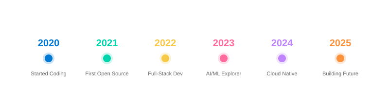

  

---

## 🐍 GitHub Contribution Snake

  

---

## 🃏 Random Dev Joke

  

*程序员的幽默 / Programmer's Humor*

---

## 📊 Repository Language Distribution

| Language | Repos | Percentage |
|:---|:---:|---:|
| **JavaScript** | 4 | 36.4% |
| **TypeScript** | 3 | 27.3% |
| **Astro** | 2 | 18.2% |
| **HTML** | 1 | 9.1% |
| **CSS** | 1 | 9.1% |

*Data from 11 original repos with language detected (158 forks excluded)*

---

## 📡 Radar Scan

  

---

## 📈 Tech Timeline

  

---

## 💡 Currently Exploring

- 🤖 **LLM Agents & Multi-Agent Systems** — Building autonomous AI workflows
- 🎥 **Generative Video & 3D** — AI-powered content creation pipelines
- 🦀 **Rust & Systems Programming** — Performance-critical applications
- ☸️ **Kubernetes & Cloud Native** — Scalable infrastructure patterns

---

  ⚡ Data sourced from GitHub REST API • Last updated: 2026
   
  🔄 Assets auto-regenerated daily via GitHub Actions

