

# 👋 Hi there, I'm **noontiger**

### 💻 Full-Stack Developer · Open Source Enthusiast · AI/ML Explorer

*Turning ideas into reality with code*

---

## 🎯 Typing Animation

  

---

## 🚀 GitHub Analytics

  

  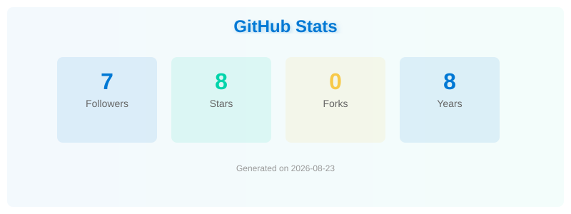
  

  

  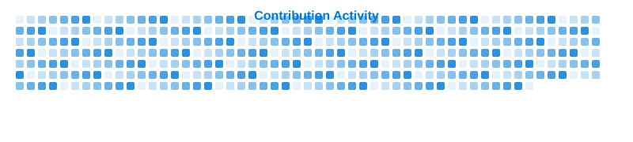

---

## 📦 Package Download Stats

---

## 🐍 GitHub Contribution Snake

  

*Auto-generated by GitHub Action — eats your contribution squares!*

---

## 🃏 Random Dev Joke

  

---

## 💬 Dynamic Quote

  

---

## 📊 Repository Language Distribution

| Language | Repos | Percentage |
|:---|:---:|---:|
| **JavaScript** | 4 | 36.4% |
| **TypeScript** | 3 | 27.3% |
| **Astro** | 2 | 18.2% |
| **HTML** | 1 | 9.1% |
| **CSS** | 1 | 9.1% |

*Data from 11 original repos with language detected (158 forks excluded)*

---

## 🧩 Bento Grid Overview

  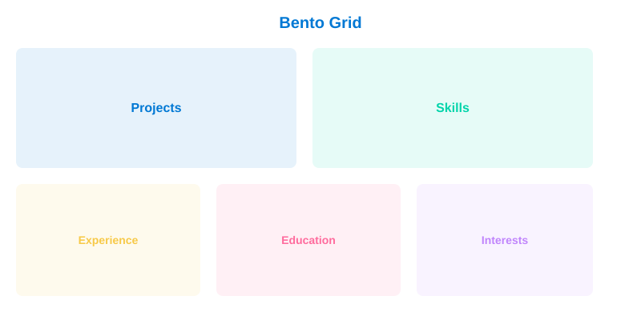

---

## 🌟 Star History

  <a href="https://star-history.com/#noontiger/noontiger&Date">
    
  </a>

---

## 🌍 Visitor World Map

  

---

## 🌐 3D Contribution Globe

  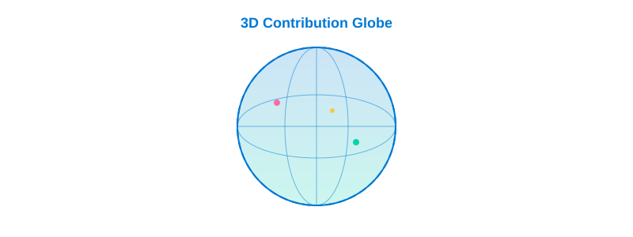

---

## 📡 Radar Scan

  

---

## 🧠 Neural Network

  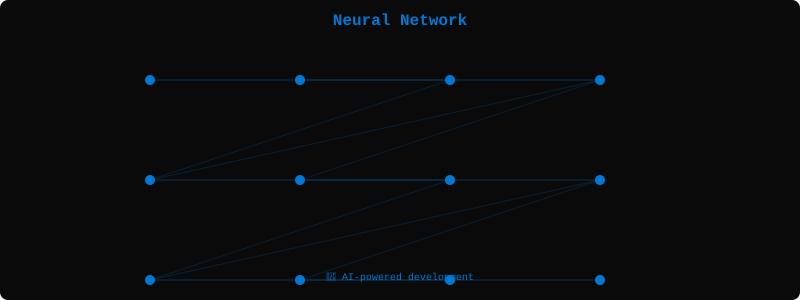

---

## 🌧️ Matrix Rain

  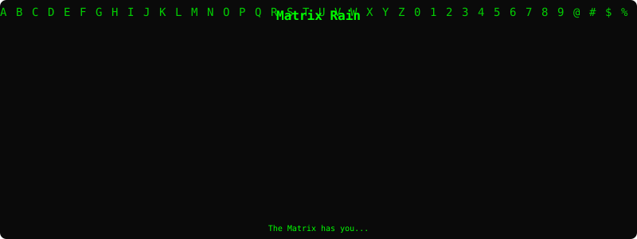

---

## 💡 Neon Glow

  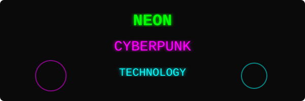

---

## 💻 Terminal

  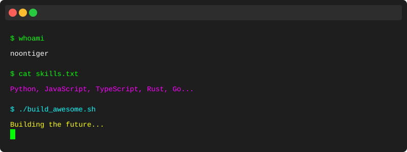

---

## 🔌 Circuit Board

  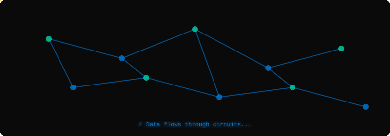

---

## 🤖 Particle Network

  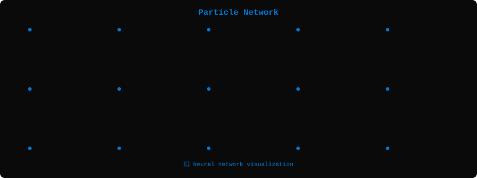

---

## 📊 Data Stream

  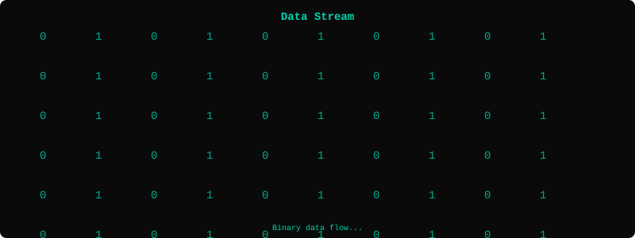

---

## 📈 Tech Timeline

  

---

## 📕 Latest Blog Posts

<!-- BLOG-POST-LIST:START -->

  

<!-- BLOG-POST-LIST:END -->

*Auto-updated via GitHub Actions*

---

## 💬 Discord Status

  

---

## ⚡ Code::Stats Experience

  

---

## 🌤️ Weather Widget

  

---

## 💖 GitHub Sponsors

  

---

## 📈 Recent Activity

<!--START_SECTION:activity-->
1. 🎉 Pushed to [speech-to-text](https://github.com/noontiger/speech-to-text) - Browser-based speech-to-text (Whisper)
2. 🎉 Pushed to [video](https://github.com/noontiger/video) - Video gallery built with Astro
3. 🎉 Pushed to [hh](https://github.com/noontiger/hh) - Personal portfolio built with Astro
4. 🎉 Pushed to [tts](https://github.com/noontiger/tts) - TTS project with Astro
5. 🎉 Pushed to [noontiger.github.io](https://github.com/noontiger/noontiger.github.io) - Personal site
<!--END_SECTION:activity-->

*Auto-updated via GitHub Actions*

---

## 👥 Follow Me

  

---

## 💡 Currently Exploring

- 🤖 **LLM Agents & Multi-Agent Systems** — Building autonomous AI workflows
- 🎥 **Generative Video & 3D** — AI-powered content creation pipelines
- 🦀 **Rust & Systems Programming** — Performance-critical applications
- ☸️ **Kubernetes & Cloud Native** — Scalable infrastructure patterns

---

  ⚡ Data sourced from GitHub REST API • Last updated: 2026
   
  🎨 Profile styled with ❤️ using dynamic badges & stats widgets — GitHub Light theme
   
  🔄 Assets auto-regenerated daily via GitHub Actions

